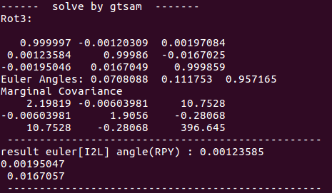
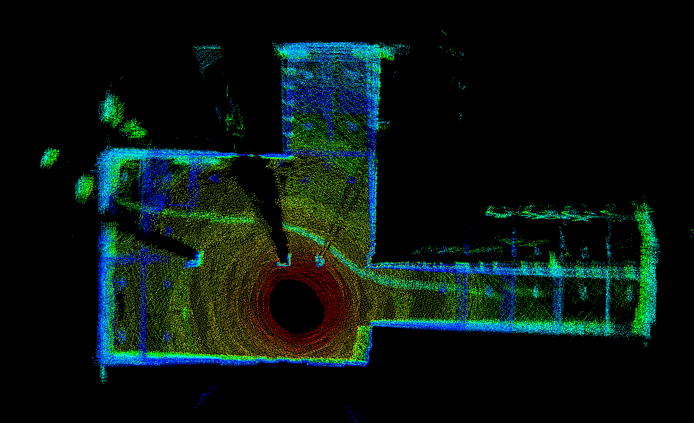

# calib_lidar_imu
Linear Rotation Calibration about Lidar-Imu


## Dependencies

- ROS (tested on Kinetic16.04)

- PCL1.9.1

- Eigen

- Ceres

- Gtsam


## Build

1. install and build ROS,PCL,ceres,gtsam

2. run

   ```
   roslaunch calib_lidar_imu calib_lidar_imu.launch
   ```

## calib result
<p align='center'>
    
</p>

<p align='center'>
    
</p>

## TODO

  - [ ]	Use scan-to-map[like loam] to solve lidar odometry pose instead of icp/ndt.
  - [ ]	Use preintegration to solve the imu pose.
## reference
[https://blog.csdn.net/u012700322/article/details/117021836]